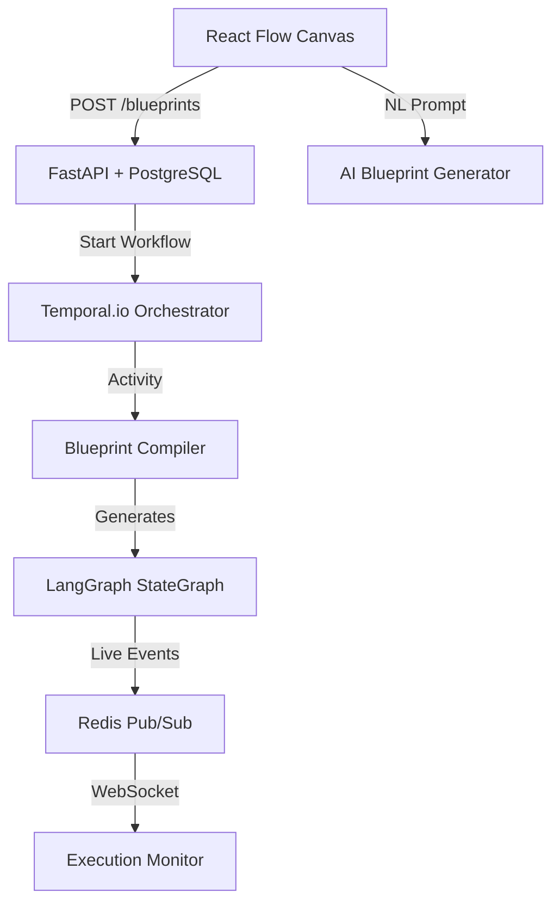

# Agent Builder Platform 🚀

**The Industrial-Grade AI Orchestrator: Visual, Durable, and Extensible.**

Agent Builder bridges the gap between drag-and-drop visual design and production-ready AI execution. Built for engineers who need more than just a script, it provides a robust platform for building complex, branching AI workflows (Blueprints) with guaranteed reliability.

---

## 🏗️ Architecture at a Glance



---

## 🎨 The "Nodes Encyclopedia"

Agent Builder provides a rich library of specialized nodes to build sophisticated agents:

### 🧩 Logic & Flow
- **Condition Node**: Branching logic using Jinja2 expressions (e.g., `{{ state.score > 0.8 }}`).
- **LLM Router**: Semantic routing that classifies inputs and directs them to specific paths.
- **Parallel Fork**: Execute multiple branches simultaneously with configurable merge strategies.
- **Loop Node**: Iterate over data arrays with support for parallel or sequential execution.

### ✨ AI & Intelligence
- **LLM Node**: Multi-model support (OpenAI, Anthropic, Gemini) with JSON or text output modes.
- **LLM Judge**: Automated quality gates with scoring thresholds and auto-retry logic.
- **Supervisor Node**: High-level agent coordination for complex multi-agent simulations.

### 🛠️ Action & Integration
- **MCP Tool Node**: Seamlessly call any tool registered in the Model Context Protocol registry.
- **Code Node**: Execute custom Python logic in a secure `RestrictedPython` sandbox.
- **Sub-Blueprint Node**: Compose complex workflows by nesting other blueprints (with version pinning).
- **Output Node**: Define final delivery formats and store results.

### 💾 Context & Persistence
- **Memory Read/Write**: Persist and retrieve state keys across different stages of execution.
- **Trigger Nodes**: Start workflows via **Webhooks**, **Schedules (Cron)**, or **Manual Invoke**.

---

## 🤖 AI-Native Authoring

Don't start from scratch. Build agents with agents:
- **Blueprint Generation**: Convert natural language descriptions into a functional React Flow graph instantly.
- **Iterative Refinement**: Add to existing canvasses by describing the changes you want.
- **Prompt Architect**: Let Claude-3.7-Sonnet optimize your node instructions for better performance.
- **Test Sandbox**: Test single nodes with mock state before running the full workflow.

---

## 🛠️ DevOps & Observability

- **Real-time Monitoring**: Stream execution events live over WebSockets with per-node timing and costs.
- **Versioning & Rollback**: Full lifecycle management with the ability to rollback to any previous version.
- **Cost Estimation**: Pre-execution cost analysis to avoid expensive model surprises.
- **Tool Health Tracking**: Monitor success rates, latency, and failure counts for all integrated MCP tools.
- **Langfuse Integration**: Deep trace links for every execution to debug chain-of-thought and latency.

---

## 🛡️ Enterprise-Grade Safety

- **Multi-tenancy**: Organization-scoped resources with RBAC and secure isolation.
- **Presidio Guardrails**: Automatic PII detection and anonymization.
- **Restricted Sandbox**: Python code execution is jailed to prevent unauthorized system access.
- **Temporal Durability**: Workflows are resumable and survive infrastructure failures.

---

## 📂 Project Structure

```text
agent-builder/
├── apps/
│   ├── agent-builder-ui/       # Vite + React Flow + Zustand
│   └── agent-builder-backend/  # FastAPI + SQLAlchemy 2.0 + Temporal
├── packages/
│   ├── workflow-engine/        # Blueprint -> LangGraph compiler
│   ├── guardrails/             # Presidio-based PII protection
│   ├── evaluator/              # Quality gates & Langfuse integration
│   ├── mcp-registry/           # Extensible tool adapters
│   └── shared-types/           # Codegen-ready Pydantic/TS models
└── infra/                      # Docker, Redis, Postgres, Temporal configs
```

---

## 🚀 Quick Start

1. **Environment**: `cp .env.example .env` and add your LLM keys.
2. **Setup**: `npm install` (Uses Turbo for workspace orchestration).
3. **Infra**: `docker-compose up -d` (Postgres, Redis, Temporal).
4. **Dev**: `npm run dev`.

---

## 📄 License
[Proprietary / TBD]
