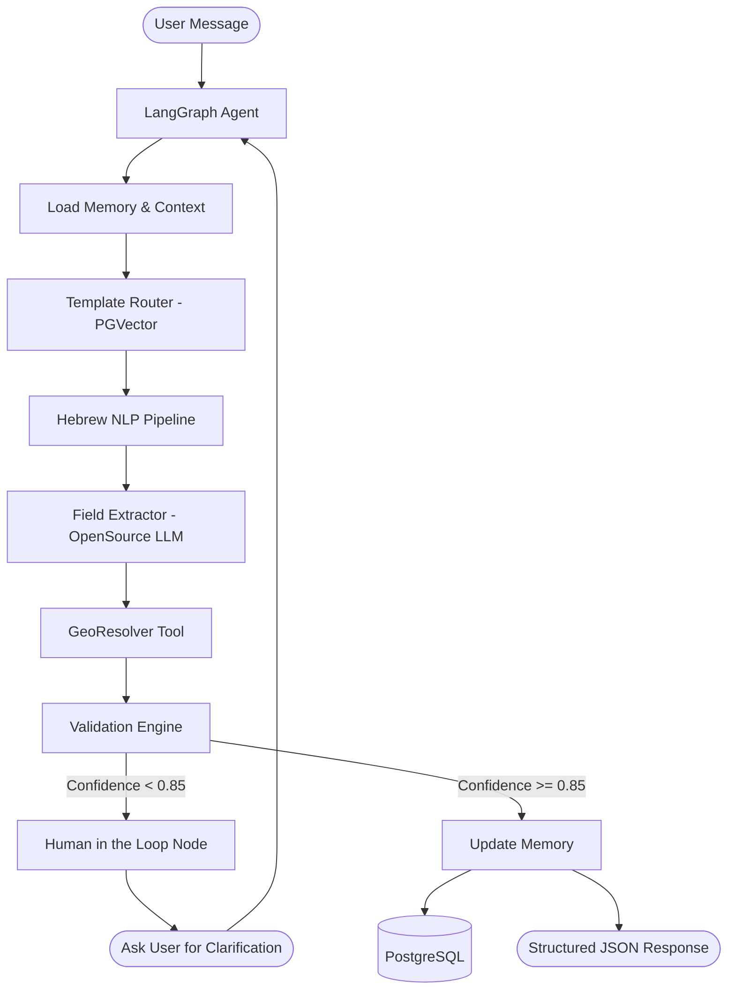

# Hebrew Message Template Structuring System - Architecture

## 1. System Architecture (Task 1.1)

### Core Components
1. **Template Registry System**: 
   - Managed via PostgreSQL (JSONB columns for dynamic schemas) + `pgvector` for semantic search.
   - Schemas are defined using standard JSON Schema definitions, strictly extended with Hebrew descriptions.
2. **Template Routing Mechanism**: 
   - Two-pass routing algorithm: Fast vector similarity search (Top-3) followed by an LLM-based exact disambiguation prompt.
3. **Hebrew NLP Pipeline**: 
   - Uses `spaCy` (`he_core_news_lg`) for fast text normalization, tokenization, and Named Entity Recognition (NER).
   - Augmented by a Retrieval-Augmented Generation (RAG) tool for specific military/organizational acronyms.
4. **Field Extraction Engine**: 
   - Schema-guided extraction using constraints (e.g., `instructor` wrapper over an OSS chat model) to mathematically guarantee valid JSON shapes.
   - Enforces grounding by explicitly requiring the text subset (citation) used for the extracted value.
5. **Geographic Resolution Module**: 
   - Uses existing tools for Address-to-Coordinates resolution, invoked dynamically via the LangGraph execution path if location data is required by the schema.
6. **Validation & HITL (Human-in-the-loop)**: 
   - Deterministic rule and confidence thresholding. If the combined field confidence is `< 0.85`, the LangGraph execution suspends at an `await_user` node, passing clarification text down to the UI.
7. **Memory & Context Management**: 
   - Session Memory handled directly by `langgraph-checkpoint-postgres`.
   - Redis handles quick-lookup cache for User/Group preferences and organizational glossaries.

### Data Flow Diagram

## 2. Technology Stack Selection (Task 1.3)

| Component | Technology / Library | Justification |
|-----------|----------------------|---------------|
| **Orchestration** | **LangGraph** | Enables scalable cyclic state-machine routing, native human-in-the-loop support (interrupts), and out-of-the-box state persistence. |
| **Primary LLM** | **Llama-3-8B-Instruct** / **DictaLM 2.0** | Extremely strong multilingual/Hebrew capabilities for Open-Source models. Capable of fast inference on local on-premise GPUs. |
| **Structured Output** | **Instructor** / **LangChain Structured Output** | Enforces perfect JSON schema compliance via function calling / constrained decoding without relying on messy regex parsing. |
| **Embedding Model** | **`intfloat/multilingual-e5-large`** | Top-tier open-weight multilingual embeddings natively supporting semantic search in Hebrew. |
| **Vector DB** | **PostgreSQL** + **`pgvector`** | Keeps infrastructure unified on-premise, leveraging existing relational databases for graph storage while supporting vector search. |
| **Hebrew NLP** | **spaCy** (`he_core_news_lg`) | Provides excellent local processing for tokenization, normalization, and base entity extraction without LLM latency. |
| **Memory State** | **`langgraph-checkpoint-postgres`** | Guarantees durable thread memory, allowing conversations and clarifications to span multiple days. |
| **Temporary Cache**| **Redis** | High-throughput lookups for user context windows, actively saving DB read overheads. |
| **Observability** | **Langfuse** | Integrates natively into Langchain/Langgraph, supplying a powerful enterprise hub for dataset administration and trace inspection. |

## 3. LangGraph Agent Design (Task 1.2)

The LangGraph node schema involves the following `TypedDict` and nodes:

* **State**: `MessageStructuringState` tracks user context, template candidates, output fields, citations, and confidence vectors.
* **Nodes**:
  1. `load_context_node`
  2. `route_template_node`
  3. `extract_entities_node`
  4. `extract_fields_node`
  5. `resolve_geo_node`
  6. `validate_node`
  7. `generate_clarification_node`
  8. `await_user_response_node`
  9. `finalize_node`
  10. `learn_node`

*(Detailed Python implementation of the nodes, edges, and state will be constructed in Part 2 of the development plan).*
